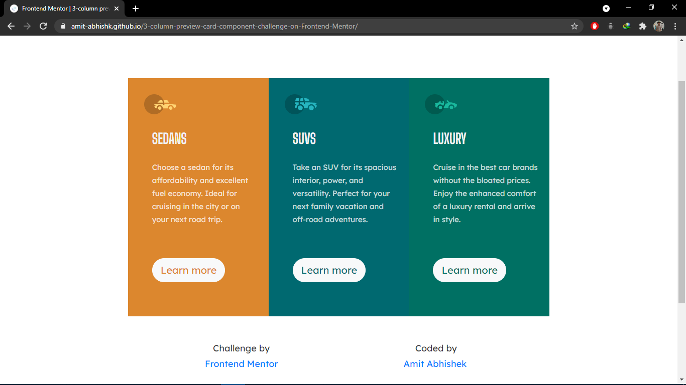

# Frontend Mentor - 3-column preview card component solution

This is a solution to the [3-column preview card component challenge on Frontend Mentor](https://www.frontendmentor.io/challenges/3column-preview-card-component-pH92eAR2-). Frontend Mentor challenges help you improve your coding skills by building realistic projects. 

## Table of contents

- [Overview](#overview)
  - [The challenge](#the-challenge)
  - [Screenshot](#screenshot)
  - [Links](#links)
- [My process](#my-process)
  - [Built with](#built-with)
  - [What I learned](#what-i-learned)
  - [Continued development](#continued-development)
  - [Useful resources](#useful-resources)
- [Author](#author)
- [Acknowledgments](#acknowledgments)

## Overview

### The challenge

Users should be able to:

- View the optimal layout depending on their device's screen size
- See hover states for interactive elements

### Screenshot

### Links

- Solution URL: [Github](https://github.com/Amit-Abhishk/3-column-preview-card-component-challenge)
- Live Site URL: [3-column-preview-card](https://amit-abhishk.github.io/3-column-preview-card-component-challenge/)

## My process

### Built with

- HTML5 markup
- CSS custom properties
- [Bootstrap](https://getbootstrap.com/docs/4.6/getting-started/introduction/)

### What I learned

Basically, I used html,css and bootstrap library to create this design which is suitable for viewing on devices of different width. It also helps me in understanding the concept of padding,margins and borders.

### Continued development

I need to brush up my bootstrap concept and need to learn to use media queries for future projects which will helps me in making more user-friendly websites as per device-width.

### Useful resources

- [Bootstrap](https://getbootstrap.com) - This helped me in accessing the class,keywords of bootstrap library. I really liked this pattern and will use it going forward.
- [MDN](https://developer.mozilla.org/en-US/) - This is an amazing website which helped me finally understand html and css concepts. I'd recommend it to anyone still learning this concept.

## Author

- Website - [3-column-preview](https://amit-abhishk.github.io/3-column-preview-card-component-challenge/)
- Frontend Mentor - [@Amit-Abhishk](https://www.frontendmentor.io/profile/Amit-Abhishk)
- Twitter - [@Amit_Abhishk](https://twitter.com/Amit_Abhishk)

## Acknowledgments

I would like to thank frontend mentor for assigning this challenge.
Various online materials helped me to solve my doubts.
I would recommend [MDN](https://developer.mozilla.org/en-US/) and [w3 school](https://www.w3schools.com/) for learning html and css concept.
Keep learning😎
Happy Coding💻